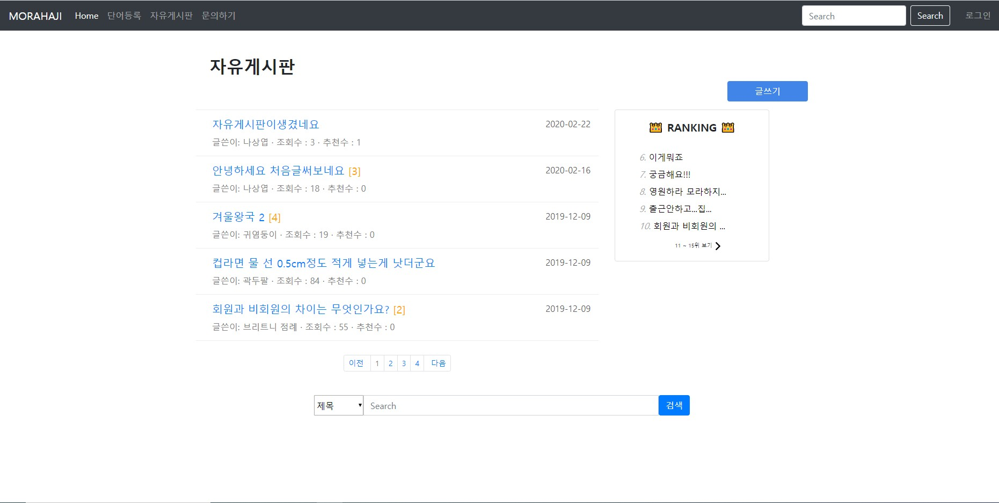

# MORAHAJI
* MORAHAJI
* 11/06/2019 ~ 12/13/2019

----
**개발 목표**

    * 신뢰도 있는 결과를 얻을 수 있는 사용자 참여형 신조어 사전 구현

    * 유저들의 토론이 가능한 자유게시판 제공

    * 파파고 번역, 검색어 자동완성, GIF 검색 등 API활용으로 유저 편의 기능 제공

**개발 환경**

    * Eclipse Jee, Mariadb 2.8.5, Tomcat 8.5
    
    * JAVA, HTML, JavaScript, jQuery, Bootstrap, Servlet
    
**담당 역할**

   
   * 자유게시판
     - 게시글쓰기/수정/삭제 기능
     - 게시글 추천(좋아요), 신고하기 기능
     - 게시글 검색 기능
     - 게시글 랭킹(추천수, 조회수) 기능
    
   * 헤더
     - 신조어단어 검색 시 자동완성 기능
   
   * 관리자 페이지
     - 신고된 게시글 관리 기능
   
   * API 사용
     - giphy : gif 검색 및 등록
        
**기타**
   * [MORAHAJI (Oracle)](https://github.com/JoyRapture/morahaji) 버전 수정
      * Oracle DB 문법의 쿼리문을 MariaDB 문법에 맞춰 변경
      * 웹호스팅
      * [실제 사이트 - MORAHAJI](http://sohee.space/morahaji/)
